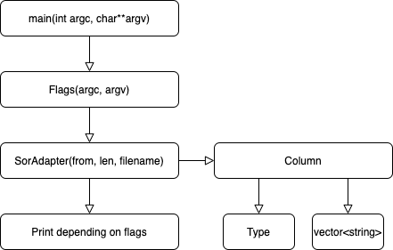

# Assignment 1 Data Adapter - TeamRP

### Program Requirements

* Read and process SoR files into a columnar format

* Do so in a fast and memory-efficient manner
#

#
For part 1, we decided to implement the SoR data adapter in C++, due to 
its high performance in comparison to other languages, ease to setup
with Docker, and availability of libraries such as vector.h and string.h. 

Processing was done by parsing the file character by character, using
switch statements on the ASCII value of each character, and using local
variables to hold the state of the SoR.

The SoR file is processed and stored in a vector of Columns. Each Column holds
an enum representing its type and a vector of strings with its associated data.

One other interesting part of our implementation was the use of the local
variable 'stagingVector' of type vector<string> when parsing the SoR file. 
The stagingVector held all of the strings for a line, and then placed those 
strings into vector of Columns after hitting a newline. This is because
we did not want to add a row until we knew the entire row would be read due to
the possibilty of a "length" stipulation. If reading of the file finishes 
not due to the length requirement, the final stagingVector is added regardless. 
